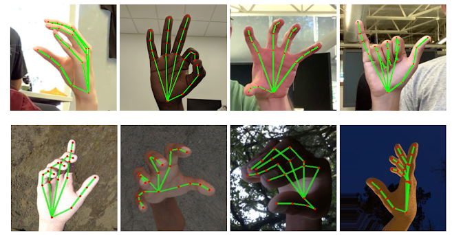
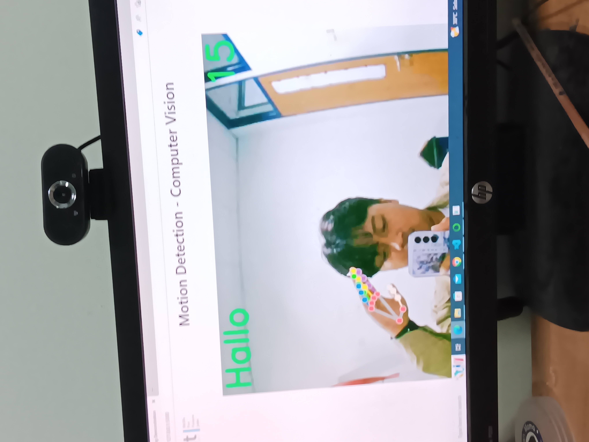

# Hand-Sign-Detection
Computer vision hand sign detection involves the use of computer algorithms and techniques to identify and interpret hand signs or gestures in visual data. This technology enables computers to understand and respond to human gestures, allowing for more natural and intuitive human-computer interactions

## Real Time Object Detection

Real-time object detection using YOLO (You Only Look Once) is a computer vision technique that allows for the simultaneous identification and localization of multiple objects in a single pass through the neural network. YOLO is known for its speed and efficiency, making it well-suited for applications that require real-time processing, such as video surveillance, autonomous vehicles, and augmented reality.

<tr>
<td></td>
<td></td>
</tr>

## Process Modelling 

Certainly! Using AlexeyAB's Darknet repository (https://github.com/AlexeyAB/darknet) provides a practical and efficient way to perform object detection. AlexeyAB has made valuable contributions to the Darknet framework, and his repository includes updates and improvements that enhance the capabilities of the original Darknet.

git clone https://github.com/AlexeyAB/darknet.git

<tr>
  <td></td>
</tr>

## Result Preview

<tr>
<td></td>
</tr>

